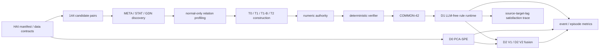

# 그래프 유도 검증 규칙 구성: 첫 연구 결과 보고서

## 1. 교수님 피드백에서 현재 연구 질문까지

초기 아이디어는 LLM이 이상 징후를 설명하는 규칙을 만들고 탐지기를 보완하는 것이었다. 그러나 ARGOS 방법론을 재현·검토하면서 자유 Python 생성, LLM이 작성한 수치 임계값, 검증/테스트 경계, 재현성 문제가 드러났다. 이에 연구 질문을 다음처럼 좁혔다.

> 정상 운전 관계 증거와 그래프 후보를 바탕으로, LLM의 역할을 제한된 구조 제안으로 통제하고, 숫자·유효성·실행을 결정론적으로 분리한 규칙 시스템을 만들 수 있는가? 그리고 그 규칙이 탐지기의 미탐에 보완 정보를 제공하는가?

따라서 현재 기여는 새 anomaly detector가 아니라 **검증 가능한 규칙 구성과 거버넌스**다. TSFM과 ARTIST식 세그먼트 선택은 현재 구현하지 않았다.

## 2. 구현 방법

HAI 23.05의 P1 Boiler를 대상으로 144개 source–target 후보 universe를 고정했다. META, STAT, upstream-aligned GDN의 top-20을 통합해 47개 고유 pair를 만들고, 정상 train1/2의 관계 프로파일링과 train3 confirmation을 거쳐 23개 pair의 42개 방향 관계를 COMMON-42로 고정했다.

규칙 구성은 T0(결정론 template), T1(1회 제한 LLM), T1-B(같은 총 call budget의 독립 생성), T2(제한된 verifier-feedback)로 비교했다. T0/T1/T1-B는 42/42 동등 실행 규칙을 만들었고 T2는 39/42, 3 no_rule이었다. 숫자는 LLM이 만들지 않고 정상 데이터에서 유도된 참조 authority에만 연결한다. verifier는 candidate/evidence/parameter/split/runtime binding을 검사하며 runtime에는 LLM이 없다.

## 3. 전체 아키텍처



상세 모듈과 완료 상태는 [방법·코드 아키텍처](04_METHOD_AND_CODE_ARCHITECTURE.md)와 [구현 상태표](05_IMPLEMENTATION_STATUS_MATRIX.md)에 정리했다.

## 4. INNER 결과

### 4.1 주 결과

| 팔 | 탐지 공격 이벤트 | Recall | 정상 false-alarm episode | Normal FAR/hour | D0 미탐 회복 |
|---|---:|---:|---:|---:|---:|
| D0 PCA-SPE | 11/14 | 0.7857142857142857 | 7 | 0.4939336325682589 | 기준 |
| D1 COMMON-42 | 13/14 | 0.9285714285714286 | 574 | 40.50255787059723 | 3/3 |
| D2 V1 | 11/14 | 0.7857142857142857 | 10 | 0.7056194750975128 | 0/3 |
| D2 V2 | 11/14 | 0.7857142857142857 | 98 | 6.915070855955625 | 0/3 |

정상 노출 시간은 51,019초다. 14개 공격 이벤트만 있으므로 통계적 우월성을 주장하지 않는다.

### 4.2 detector–rule 보완성

| 이벤트 집합 | 개수 |
|---|---:|
| D0와 D1 모두 탐지 | 10 |
| D0만 탐지 | 1 |
| D1만 탐지 | 3 |
| 둘 다 미탐 | 0 |
| D0 ∪ D1 | 14/14 |

```text
14 attack events
┌────────────────────────────────────┐
│ BOTH 10 │ D0 ONLY 1 │ D1 ONLY 3 │ NEITHER 0 │
└────────────────────────────────────┘
```

D1은 D0가 놓친 세 이벤트를 모두 포착했다. 그러나 D1의 정상 FAR은 매우 높아 단독 운용을 지지하지 않는다.

### 4.3 D2 V1과 V2

D2 V1은 같은 초에 서로 다른 source 두 개 이상이 동시에 활성화될 때만 rule recovery를 허용했다. D0 미탐 세 이벤트는 이 gate를 만족하지 못했으며, V1 recovery는 0/3이었다.

D2 V2는 COMMON-42의 native horizon 동안 causal evidence token을 유지해 asynchronous corroboration을 허용했다. 하지만 역시 0/3이었고 incremental recall은 0.0이었다. 반면 Normal FAR/hour는 V1의 0.7056194750975128에서 V2의 6.915070855955625로 증가했다. 즉 temporal memory만으로는 유용한 fusion을 만들지 못했다.

## 5. 대표 설명 사례

아래는 공개된 COMMON-42 descriptor에서 고른 예다. 실제 수치 임계값과 공격 좌표는 표시하지 않는다. trace는 runtime이 기록하는 판정 단계를 사람이 읽을 수 있게 요약한 것이다.

| 사례 | source 역할 | target 역할 | 관계 | horizon | sanitized satisfaction trace | 결과·설명 범위 |
|---|---|---|---|---:|---|---|
| A | 유량 제어밸브 command/feedback `P1_FCV01D` | 유량 센서 `P1_FT02` | source step-up → target decrease | 1초 | source 안정 → step-up 충족 → 1초 후 기대 감소 검사 → 불일치 시 alarm | 어떤 밸브 전이가 어떤 유량 반응과 어긋났는지 국소화. 고장의 인과 원인은 증명하지 않음 |
| B | 압력 제어밸브 `P1_PCV01D` | 압력 센서 `P1_PIT01` | source step-up → target increase | 60초 | source transition 검출 → native 60초 window → 기대 증가 만족 여부 → rule outcome | 느린 압력 반응 관계를 시간 창과 함께 설명. 공격 주체나 root cause는 증명하지 않음 |
| C | 수위 제어밸브 `P1_LCV01D` | 압력 센서 `P1_PIT01` | source step-up → target decrease | 10초 | step-up·안정성 확인 → 10초 후 target 방향 검사 → 근거 trace와 outcome | 교차 변수의 시간적 연계를 보여줌. 사람에게 유용한 설명인지 평가하지 않음 |

이는 ARTIST식 segment proposal은 아니지만, **전이 시점–변수쌍–지연 창–기대 반응–판정 trace**를 통해 time-variable-relation localization을 제공한다. 현재 설명 인터페이스이지, human usefulness evaluation 완료를 뜻하지 않는다.

## 6. 하이퍼파라미터와 불확실성

후보 top-K 20(보조 10/40), horizon 1/5/10/30/60초, refractory 10초, isolation radius 2초, fit/calibration support·consistency·effect-ratio gate, PCA variance target 0.95, selected k 10, threshold quantile 0.999, D2 distinct-source count 2가 동결돼 있다.

이 값들은 사전 protocol, upstream reference, normal-only calibration 또는 구조적 정책에서 왔지만 전체 sensitivity sweep을 수행하지 않았다. 특히 D2 gate는 관측된 구조적 mismatch가 있고, PCA-SPE는 reference baseline이다. 값과 위험은 [하이퍼파라미터 레지스터](06_HYPERPARAMETER_PROVENANCE_REGISTER.md)에 구분했다.

## 7. OUTER 결과가 없는 이유

OUTER는 D0/D1/D2 V1에 대해 사전등록됐지만, 허가된 1회 시도가 test2 feature custody 접근에서 바이트 읽기 전에 거부됐다.

| 항목 | 기록 |
|---|---:|
| scientific attempt | 1회 소비 |
| feature custody access attempt | 1 |
| feature bytes read / hash / semantic parse | 0 / 0 / 0 |
| label access / parse | 0 / 0 |
| D0/D1/D2 실행 | 0 / 0 / 0 |
| prediction / metric | 없음 / 없음 |
| outcome leakage | 0 |

따라서 이는 부정적 OUTER 과학 결과가 아니다. OUTER 결과는 **unavailable**, 일반화는 **unconfirmed**다. 자동 재시도는 제안하지 않는다. 필요하면 교수님 승인 후 새 독립 preregistration으로 별도 연구를 설계해야 한다.

## 8. 주장 경계

지원되는 핵심은 그래프 유도 후보 큐레이션, 실행 가능한 검증 규칙, 정상 데이터 수치 권한, 결정론적 verifier, LLM-free runtime, INNER 규칙 민감도, detector–rule event complementarity, 재현 가능한 negative fusion evidence다.

지원되지 않는 것은 combined detector 향상, D1의 운용 가능성, D2 우월성, TSFM/ARTIST 효과, agentic repair 성능 최적화, held-out 일반화, causal root cause, 사람 설명 유용성이다. 구체 문구는 [claim matrix](07_CLAIM_MATRIX.md)에 있다.

## 9. 결론과 교수님 결정

과학적 결론은 `RULE_SIGNAL_PRESENT_BUT_CURRENT_FUSION_UTILITY_UNSUPPORTED`다. 규칙 연구 자체는 실행·검증·보완 신호라는 기여를 만들었지만 “결합 탐지 성능 향상”은 결과로 지지되지 않는다.

교수님께 요청드리는 결정은 네 가지다.

1. 논문 기여를 그래프 유도 규칙 구성과 결정론적 검증으로 확정할지
2. trace 기반 설명을 주 인터페이스로 인정할지, ARTIST식 segment selection을 추가할지
3. 새 OUTER 연구를 먼저 할지, INNER 범위 주장으로 논문을 먼저 쓸지
4. PCA-SPE 외 강한 detector baseline을 하나 더 요구할지

권고 기본안은 **`THESIS_FIRST_PENDING_PROFESSOR_FEEDBACK`**이다.

## 부록: 핵심 공개 근거

- D0/D1/D2 비교: `TASK-039E3_R2R_UTILITY_INNER_D0_D1_D2_COMPARISON_V1_*`
- D2 V1/V2 disposition: `TASK-039E3_R2R_UTILITY_INNER_D2_V1_V2_DISPOSITION_V1_*`
- D2 V2 integrity completion: `TASK-039E3_R2R_UTILITY_INNER_D2_V2_RESULT_INTEGRITY_COMPLETION_V1.json`
- COMMON-42 relation cohort: `TASK-039E0_CONFIRMED_RELATION_COHORT.json`
- OUTER custody failure: `TASK-039E3_R2R_UTILITY_OUTER_D0_D1_D2V1_EXECUTION_RECOVERY_V1_BLOCKER.json`

세부 commit과 artifact 인덱스는 [재현성과 코드 상태](08_REPRODUCIBILITY_AND_CODE_STATUS.md)에서 분리해 제공한다.

