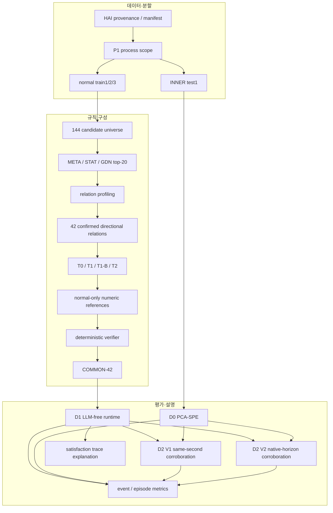

# 방법과 코드 아키텍처

## end-to-end map

## 계층별 책임

| 계층 | 핵심 책임 | 대표 경로 | 상태 |
|---|---|---|---|
| scientific kernel | 후보, 프로파일링, 규칙 의미, D0/D1/D2 계산 | `src/paperworks/v6/`, `src/paperworks/profiling/`, `src/paperworks/gdn/` | 완료·연구용 |
| authority/contracts | rule/evidence/parameter/verifier/runtime binding | `src/paperworks/contracts/`, v6 authority modules | 완료 |
| custody | raw/private data와 numeric/evidence를 Git 밖에서 보호 | custody modules, path-redaction receipts | 완료·로컬 의존 |
| reporting | 공개 결과, self-hash, metric/result 보고 | `docs/task_reports/`, reporting scripts | 완료, 역사적 remediation 다수 |
| continuity/governance | scope, 승인, handoff, ledger | `docs/project_state/` | 완료·운영 오버헤드 큼 |

## 네 구성 arm

| arm | 목적 | 결과 |
|---|---|---|
| T0 | 결정론 template baseline | 42/42 COMMON |
| T1 | 1회 constrained LLM | 42/42 COMMON equivalent |
| T1-B | 동일 총 call budget, 독립 생성 | 42/42 COMMON equivalent |
| T2 | bounded verifier-feedback | 39/42 accepted, 3 no_rule; feedback action 0 |

현재 근거는 agentic repair가 성능을 높인다는 주장을 지지하지 않는다. 규칙 과학의 핵심은 제한된 contract와 독립 검증이다.

## 설명 경로

runtime trace는 source transition이 충족됐는지, frozen delay/horizon 뒤 target 방향이 기대와 일치했는지, 최종 outcome이 alarm/satisfied/abstain 중 무엇인지 묶는다. 이 구조는 재현 가능한 관계 기반 local explanation을 제공하지만 인과 추론이나 사람 유용성 검증은 아니다.

