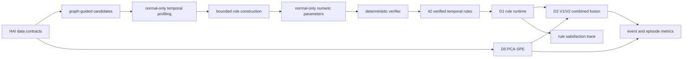

# 그래프 유도 검증 시간 규칙: 1차 연구 결과

## 1. 연구 문제

전통적인 다변량 이상탐지기는 이상 점수나 경보를 제공하지만, 공정
변수 사이에서 **무슨 변화가 발생했고, 얼마 뒤 어떤 반응이
기대됐으며, 실제 반응이 왜 규칙을 위반했는지**를 사람이 읽을 수 있는
형태로 설명하는 데 한계가 있습니다.

본 연구는 다음 질문을 다룹니다.

> 정상 운전 데이터에서 확인한 시간적 변수 관계를, LLM이 임의 수치나
> 실행 코드를 결정하지 못하도록 통제하면서 실행 가능한 규칙으로
> 구성·검증할 수 있는가? 이 규칙은 기준 탐지기의 미탐에 보완 정보를
> 제공하는가?

## 2. 교수님 피드백 이후의 방향 변경

초기에는 LLM이 이상 현상을 설명하는 규칙을 비교적 자유롭게 만드는
방향을 검토했습니다. 그러나 과학적 재현성과 통제 가능성을 높이기
위해 LLM의 역할을 제한했습니다.

- **이전 방향:** LLM이 규칙 구조·수치·설명을 폭넓게 생성
- **현재 방향:** LLM은 허용된 관계 안에서 typed/bounded 구조만 제안
- **결정론적 통제:** 숫자는 정상 데이터에서만 결정하고 verifier가
  구조·근거·파라미터·실행 가능성을 검사
- **실행:** 최종 runtime과 satisfaction trace에는 LLM을 사용하지 않음

TSFM은 현재 사용하지 않았고, ARTIST식 세그먼트 선택도 구현하지
않았습니다. 현재 설명은 **시간 규칙의 변수 관계와 만족 trace**에
기반합니다.

## 3. 제안 방법과 구현



### 3.1 관계 발견과 프로파일링

HAI 23.05 P1 Boiler의 144개 source–target 후보쌍에서 metadata,
통계 관계, graph-based ranking을 분리해 후보를 찾았습니다. 정상
운전 데이터에서 source step 이후 target response를 1, 5, 10, 30,
60초 horizon으로 프로파일링하고, 별도 정상 구간에서 방향과 효과를
확인했습니다. 최종적으로 23개 변수쌍의 42개 방향 관계를 고정했습니다.

### 3.2 제한된 규칙 구성

결정론적 template과 제한된 LLM 구성 방식을 비교했습니다. LLM은
후보 밖의 변수를 선택하거나 수치 파라미터를 만들 수 없습니다.
수치는 정상 데이터의 고정 참조를 사용하며, deterministic verifier가
관계 근거와 실행 조건을 승인해야 최종 규칙이 됩니다.

### 3.3 실행과 설명

규칙 runtime은 source transition, 고정 lag/horizon, 기대 target
response, 실제 만족 여부를 기록합니다. 이 trace는 어느 변수 관계가
어떤 시간 범위에서 어긋났는지를 보여주지만, 공격 원인이나 인과적
root cause를 증명하지는 않습니다.

## 4. 1차 INNER 결과

### 4.1 주 결과

| 방법 | Attack-event Recall | Normal FAR/hour | D0 미탐 회복 |
|---|---:|---:|---:|
| D0: PCA-SPE reference detector | 0.7857142857142857 | 0.4939336325682589 | 기준 |
| D1: verified temporal rules | 0.9285714285714286 | 40.50255787059723 | 3/3 |
| D2 V1: same-second fusion | 0.7857142857142857 | 0.7056194750975128 | 0/3 |
| D2 V2: native-horizon fusion | 0.7857142857142857 | 6.915070855955625 | 0/3 |

### 4.2 이벤트 수준 보완성

14개 공격 이벤트 중 D0와 D1이 함께 탐지한 이벤트는 10개, D0만
탐지한 이벤트는 1개, D1만 탐지한 이벤트는 3개, 둘 다 놓친 이벤트는
0개였습니다. 따라서 `D0 ∪ D1 = 14/14`였고, D1은 D0가 놓친 `3/3`을
모두 탐지했습니다.

```text
14 attack events
┌─────────────────────────────────────────────┐
│ BOTH 10 │ D0 ONLY 1 │ D1 ONLY 3 │ NEITHER 0 │
└─────────────────────────────────────────────┘
```

이는 규칙 계층에 reference detector와 다른 이벤트 정보가 있음을
보여줍니다. 그러나 D1의 Normal FAR/hour는 `40.50255787059723`으로
높아 규칙 단독 운용 가능성을 지지하지 않습니다.

### 4.3 결합 정책 결과

D2 V1은 같은 초에 서로 다른 source의 규칙 신호가 두 개 이상 있을
때만 D0 미탐을 보완하도록 설계했습니다. D2 V2는 각 규칙의 정상
관계 horizon 동안 신호를 유지해 비동기 보완을 허용했습니다.

두 정책 모두 D0가 놓친 세 이벤트를 `0/3`만 회복했고 recall은 D0와
동일했습니다. V2는 시간 기억을 추가했지만 Normal FAR/hour가 V1의
`0.7056194750975128`에서 `6.915070855955625`로 커졌습니다. 즉 현재
두 fusion은 보완 신호를 유용한 detector improvement로 전환하지
못했습니다.

공격 이벤트가 14개뿐이므로 어떤 방법의 통계적 우월성도 주장하지
않습니다.

## 5. 무엇이 작동했고, 무엇이 작동하지 않았나

### 작동한 것

- 그래프 유도 후보 관계 발견과 정상 데이터 기반 확인
- 42개 verified temporal rules의 구성·결정론적 검증·실행
- LLM 없이 재현되는 rule-satisfaction trace
- INNER 이벤트에서 D0와 D1의 보완성

### 작동하지 않은 것

- rule-only arm의 운용 가능한 정상 오경보 수준
- D2 V1/V2를 통한 D0 미탐 회복과 incremental recall
- verifier feedback이 성능 최적화를 한다는 주장

### 아직 불확실한 것

- held-out 일반화
- 강한 multivariate detector에서도 규칙 보완성이 유지되는지
- TSFM 또는 ARTIST식 segment selection의 추가 효용
- 규칙 trace의 사람 대상 설명 유용성

## 6. 핵심 하이퍼파라미터 공개

| 구분 | 주요 항목 | 현재 평가 |
|---|---|---|
| 사전 고정·정상 데이터 기반 | horizon grid `1/5/10/30/60초`; 관계 acceptance support/consistency/effect gates | 근거와 동결 시점은 명확하나 일부 threshold sensitivity는 미실시 |
| reference detector | PCA explained variance `0.95`; D0 threshold quantile `0.999` | 비교 기준선용이며 최적 detector 주장 아님 |
| fusion 구조 | 서로 다른 source `2개` corroboration | single-source false alarm 억제를 위한 구조적 선택 |
| 구조적 한계 관측 | V1 exact same-second; V2 native-horizon persistence | V1/V2 모두 회복 0/3, V2 FAR 증가 |

전체 16개 항목은 [하이퍼파라미터 부록](appendix/C_HYPERPARAMETER_REGISTER.md)에
정리했습니다. 이번 보고서에서는 값을 변경하거나 sensitivity를 새로
실행하지 않았습니다.

## 7. OUTER와 일반화 범위

사전등록된 held-out 평가는 과학 결과를 만들지 못했습니다. 실행은
test2 feature bytes나 labels를 읽기 전 데이터 관리 경계에서
중단됐습니다. 따라서 held-out outcome information은 관측되지
않았으며, 현재 실증 주장은 INNER 평가로 제한됩니다.

이 상태는 부정적 OUTER 과학 결과가 아닙니다. 새로운 held-out 연구가
필요하다면 교수님 승인 후 별도로 사전등록해야 합니다.

## 8. 잠정 기여와 주장 경계

**PROVISIONAL_PENDING_PROFESSOR_APPROVAL**

1. 정상 CPS 데이터의 다변량 시간 관계를 그래프 유도로 발견·확인
2. LLM의 구조 제안은 제한하되 숫자와 최종 validity는 결정론적으로
   통제하는 규칙 구성 workflow
3. time-variable relationship을 보여주는 실행 규칙과 satisfaction trace
4. detector–rule event complementarity와 실패한 fusion을 함께 보고한
   재현 가능한 실증 분석

지원되지 않는 주장은 combined detector 향상, causal root-cause
설명, held-out 일반화, TSFM/ARTIST 효과, rule-only 운영 가능성입니다.
자세한 문구는 [주장 부록](appendix/D_CLAIM_MATRIX.md)에 있습니다.

## 9. 결론

`RULE_SIGNAL_PRESENT_BUT_CURRENT_FUSION_UTILITY_UNSUPPORTED`

규칙 연구는 실행 가능한 관계 설명과 reference detector에 대한
이벤트 수준 보완 신호를 만들었습니다. 하지만 현재 결합 정책의 성능
향상은 지지되지 않습니다. 따라서 다음 단계는 자동적인 fusion 추가
개발이 아니라, 교수님과 논문 기여·설명 범위·검증 순서·baseline
범위를 확정하는 것입니다.

요청드리는 정확히 네 가지 선택지는 [결정 요청](04_DECISIONS_REQUESTED.md)에
정리했습니다.
