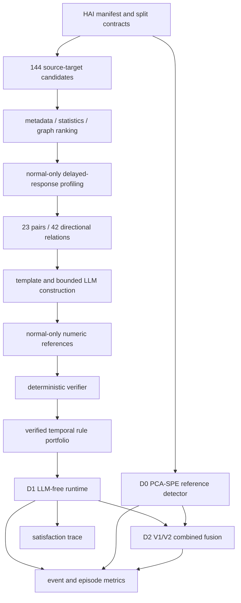

# 부록 A — 방법 아키텍처

## 전체 흐름

## 구성 요소의 책임

| 구성 | 역할 | 현재 상태 |
|---|---|---|
| 데이터·분할 계약 | 정상 학습, INNER 평가, held-out 경계 분리 | 완료 |
| 후보 발견 | 공통 144-pair universe에서 bounded ranking | 완료·연구용 |
| 관계 프로파일링 | source step 뒤 target delayed response 확인 | 완료 |
| 규칙 구성 | template 및 bounded LLM 구조 제안 | 완료·연구용 |
| 숫자 결정 | 정상 데이터의 고정 reference만 허용 | 완료 |
| deterministic verifier | 구조·관계 근거·파라미터·실행 조건 확인 | 완료 |
| D1 runtime | 42개 규칙을 LLM 없이 실행 | 완료·연구용 |
| D0 detector | PCA-SPE reference baseline | 완료 |
| D2 fusion | V1 same-second, V2 native-horizon corroboration | 완료·negative evidence |
| 설명 | source–target–lag/horizon–outcome trace | 완료·사람 유용성 미평가 |

## 설명 예시의 읽는 법

규칙 trace는 다음 질문에 답합니다.

1. 어떤 source variable에 어떤 transition이 있었는가?
2. 고정 lag/horizon 뒤 어떤 target response가 기대됐는가?
3. 실제 target 방향이 기대와 일치했는가?
4. 규칙은 satisfied, alarm, abstain 중 무엇을 냈는가?

이는 시간 관계 위반의 근거이지 causal root cause 증명은 아닙니다.

더 상세한 개발용 아키텍처는
[기존 전체 문서](../../professor_first_results_v1/04_METHOD_AND_CODE_ARCHITECTURE.md)를
참조할 수 있습니다.
