# TASK-039E3 R2R Utility Authority Reconstitution Feasibility Audit

## Status and decision

Status: `passed_task039e3_r2r_utility_authority_reconstitution_feasibility_audit`.

Selected route: `ROUTE_C_NEW_NORMAL_ONLY_AUTHORITY_RECONSTITUTION_REQUIRED`.

This is a dependency and governance decision, not utility authorization. Historical construction validity and terminal-custody validity remain unchanged, and utility remains `NOT_EXECUTED`. The correct current fact is that the original private authorities are unavailable in the current searched/authorized environment; this audit makes no claim that they were destroyed or historically invalid.

## Executive finding

The committed repository contains a frozen, deterministic COMMON-42 executable projection: 42 exact relation bindings, source and target identities, directions, horizons, numeric-reference identities, window-reference identities, and semantic execution hashes. T0, T1, and T1-B share that executable projection for all 42 relations. T2's 39 accepted rules match the corresponding COMMON projection, but the public artifact preserves only the aggregate `39 accepted / 3 no_rule` result and a private mapping hash, not the exact three-relation membership.

The actual utility computation path needs executable semantics, numeric values, future feature inputs, and future label custody. It does not consume raw provider requests/responses or terminal proposal-envelope records. The missing 420-record numeric registry is a genuine data-plane input. The E1 ledger is its upstream materialization source, but is not itself a direct V3 evaluator input.

Exact E1 identity cannot currently be rematerialized because the original D1 source, D1 target, D1 directional-fit, and D2 confirmation private ledgers are unavailable. The numeric registry is deterministic from exact E1 plus the committed executable-equivalence artifact, so it is also blocked by the absent E1 ledger.

The defensible remaining route is therefore a new, explicitly versioned normal-only numeric authority, not historical E1 restoration. That later authority can in principle be derived from the frozen relation identities, deterministic continuous-step calibration method, and exact normal-file identities. It must receive a new identity, be independently audited, and remain limited to COMMON-42 unless exact T2 membership is separately restored.

## Six-authority classification

| Missing locator | Primary classification | Utility data-plane role | Finding |
|---|---|---:|---|
| `TASK039E3_E1_PRIVATE_LEDGER` | `RESTORE_ORIGINAL_ONLY` | No, upstream of the registry | Exact rematerialization is deterministic only if all four original D1/D2 private ledgers are present; they are unavailable. |
| `TASK039E3_UTILITY_NUMERIC_REGISTRY_V2` | `RESTORE_ORIGINAL_ONLY` | Yes | `resolve_numeric_reference_v2` consumes its 420 records to return numeric values. Exact rebuilding is blocked by unavailable E1. |
| `TASK039E3_SUCCESS_PUBLIC_ROOT` | `PUBLIC_ATTESTATION_SUFFICIENT_IF_POLICY_VERSIONED` | No | The original public directory is provenance; committed audit artifacts bind its eight artifact hashes and successful receipt. |
| `TASK039E3_SUCCESS_PRIVATE_ROOT` | `NOT_REQUIRED_FOR_UTILITY_DATA_PLANE` | No | Provider, proposal/validity, outcome, and Direct-number ledgers are construction custody. Exact T2 membership remains an explicit provenance caveat. |
| `TASK039E3_TERMINAL_CUSTODY_PUBLIC_ROOT` | `PUBLIC_ATTESTATION_SUFFICIENT_IF_POLICY_VERSIONED` | No | Committed reports bind the supplemental custody and evaluability result. |
| `TASK039E3_TERMINAL_CUSTODY_PRIVATE_ROOT` | `NOT_REQUIRED_FOR_UTILITY_DATA_PLANE` | No | The 251 proposal-envelope/hash preimages establish historical custody but are not evaluator inputs. |

The detailed field- and function-level evidence is frozen in `TASK-039E3_R2R_UTILITY_AUTHORITY_DEPENDENCY_MATRIX.json`.

## Minimal utility data plane

The repository contains protocol primitives, not a completed or authorized real-data evaluator. The minimal computation path implied by those primitives is:

1. Select an exact frozen executable relation using `relation_binding_hash` and `semantic_execution_hash`.
2. Resolve source threshold, source stability tolerance, target scale, and fixed window references to finite numeric values.
3. Parse and validate the future feature frame under the frozen feature, file, and split authority.
4. Derive full-census source events and applicable relation opportunities.
5. Evaluate target response windows to produce deterministic alarm or abstention records.
6. Form alarm episodes.
7. Build strict label/event custody from the same future label vector.
8. Compute AttackEventRecall, NormalFalseAlarmRatePerHour, and the frozen secondary metrics.

Computation inputs are therefore the executable projection, numeric values, feature data, label data, and frozen evaluation policies. Success/terminal private provider custody is not consumed by these steps.

## E1 exact rematerialization feasibility

`task039e1_evidence_materialization_v1.py` is deterministic and data-loader free. It consumes:

- the committed E0 confirmed-relation cohort;
- the private 12-record D1 source-parameter ledger;
- the private 12-record D1 target-parameter ledger;
- the private 94-record D1 directional-fit ledger;
- the private 45-record D2 confirmation ledger;
- the preregistered D0 constants; and
- the exact execution commit embedded in the output hash preimage.

The exact materializer implementation from execution commit `e8fd2ed47bb0214a0e364bf978eebe75ae4a79a3` remains byte-identical at the audit base, with Git blob `af4401cbcf2240df8523a36c0ff69a197fdfae4b`. It does not reread HAI. Given every exact original input, it is capable in principle of reproducing the historical ledger hash `0998c6600078b8a0aca7263b6e0b702808cc141b1cbcfe3d0026fddb98c408a7`.

That conditional property is not current rematerialization feasibility. The four original D1/D2 private ledger locators are unavailable; their exact content cannot be reconstructed from public hashes. Under the task's identity rule, E1 is therefore `RESTORE_ORIGINAL_ONLY`, not `RE_MATERIALIZABLE_EXACT_IDENTITY`.

## Numeric-registry feasibility

`build_private_numeric_registry_v2` is deterministic from exactly two scientific inputs: the exact E1 ledger and the committed executable-equivalence artifact. It selects the 420 authorized references, copies the bound E1 values and provenance preimages, sorts records by reference, and self-hashes the result. It needs no additional private authority.

The builder source introduced at V2 remains unchanged at the audit base, with Git blob `17520e8016d580c5ef8cbc0c7084330c95a1b2d1`. Exact E1 recovery would therefore be sufficient in principle to reproduce registry hash `59e81b261801f28eefc917256dc628af704a14b4064161972d01545968555271`. Because exact E1 is unavailable, current exact-hash reproduction is not available.

## COMMON-42 authority

Classification: `FROZEN_EXECUTABLE_AUTHORITY_AVAILABLE`.

The independent public-artifact oracle established:

- executable-equivalence self-hash: exact `3efdce159bc5ac39825d4e4654428237e47205307f83aae7a133db6c5789f60f`;
- relation records: `42`;
- COMMON accepted/no_rule: `42/0`;
- relation-binding set equals the E1 public manifest set;
- each semantic execution hash recomputes from its signature;
- source, target, directions, horizon, and all ten utility numeric-role references match the E1 manifest;
- the E1 manifest entries exactly equal those embedded in cohort `4eb4da843a61a9c72aba59edcdf90e49766fc571af7eade14d500b3d04d363d4`; and
- the public numeric authority binds that cohort, E1 ledger, and private registry hash.

Thus a future evaluator does not need four separate provider-derived rule libraries. It can use one COMMON-42 deterministic executable authority for T0/T1/T1-B. It still needs actual numeric values from restored or newly versioned authority. Exact T2 membership is not public and cannot be inferred from the aggregate `39/3` result.

## Success and terminal private custody

The successful private root historically held four record classes:

| Record class | Future utility classification |
|---|---|
| Scientific provider requests/responses and metadata | `PROVENANCE_ONLY`; not consumed by utility |
| Proposal envelope, materialized project proposal, and deterministic validity | `PROVENANCE_ONLY` after COMMON executable projection; construction-analysis source |
| Accepted/no_rule construction outcome | `PROVENANCE_ONLY` for COMMON; needed to restore exact T2 membership |
| Direct-number output/error record | `CONSTRUCTION_ANALYSIS_ONLY`; prohibited as utility numeric authority |

The terminal private supplement contains proposal-envelope, proposal-hash, and validity-hash preimages for 251 records. It established independent historical custody and is not accepted by any source-event, target-response, opportunity-custody, label-custody, or metric function.

## Public-attestation hypothesis

Assessment: `FEASIBLE_TO_PROPOSE_NEW_VERSIONED_INTERFACE`.

A new interface could defensibly bind the successful execution receipt, accounting hash, terminal supplement hash, terminal independent Audit A/B authority, frozen COMMON-42 executable projection, and an independently audited numeric authority. This conclusion is restricted to feasibility. The interface is not already authorized and would require its own freeze and independent audit. It must either exclude T2 or separately regain exact T2 membership.

## New normal-only authority

Assessment: `NEW_NORMAL_ONLY_AUTHORITY_FEASIBLE_IN_PRINCIPLE`.

Public custody freezes the train1/train2/train3 filenames, SHA-256 identities, row counts, dataset manifest, 42 confirmed relation identities, deterministic calibration formulas, and leakage boundaries. The source thresholds, stability tolerances, and target scales were fit from train1/train2; train3 confirmed relation directions but did not influence those parameter values. No normal values were accessed in this audit. A later authorized task could verify the exact train1/train2 payloads and derive a new normal-only numeric authority while preserving the already-frozen train3 confirmation result.

That output would be a new authority version. It would not restore historical E1 identity, and its references must not be presented as the historical 420-reference registry even if some computed values happen to agree.

## Data-flow diagram

```mermaid
flowchart LR
    D12["D1/D2 evidence<br/>PRIVATE + PUBLIC / HISTORICAL"]
    E1["E1 numeric authority<br/>PRIVATE / HISTORICAL"]
    C["T0 / T1 / T1-B / T2 construction<br/>PRIVATE / HISTORICAL"]
    V["Verifier-admitted outcomes<br/>PRIVATE + public attestations / HISTORICAL"]
    X["COMMON-42 executable authority<br/>PUBLIC / HISTORICAL"]
    F["HAI utility feature access<br/>PRIVATE / FUTURE_NOT_EXECUTED"]
    P["Deterministic rule predictions<br/>FUTURE_NOT_EXECUTED"]
    L["HAI labels<br/>PRIVATE / FUTURE_NOT_EXECUTED"]
    M["Utility metrics<br/>FUTURE_NOT_EXECUTED"]

    D12 -->|"PRIVATE / HISTORICAL"| E1
    E1 -->|"PRIVATE numeric references / HISTORICAL"| C
    C -->|"PRIVATE proposals / HISTORICAL"| V
    V -->|"PUBLIC deterministic projection"| X
    X -->|"provider-private custody exits computation data plane"| F
    F -->|"PRIVATE features / FUTURE_NOT_EXECUTED"| P
    E1 -.->|"numeric values required; original unavailable"| P
    P -->|"alarms / FUTURE_NOT_EXECUTED"| M
    L -->|"label/event custody / FUTURE_NOT_EXECUTED"| M
```

## Route decision

`ROUTE_A_RESTORE_ORIGINAL_AND_RESUME_V4` is not selected because the authorized locator recovery was exhausted and no concrete remaining restoration route is known.

`ROUTE_B_EXACT_REMATERIALIZE_E1_NUMERIC_THEN_V4_1_AUTHORITY_INTERFACE_FREEZE` is not selected because the exact original D1/D2 private ledgers required for E1 are unavailable.

`ROUTE_C_NEW_NORMAL_ONLY_AUTHORITY_RECONSTITUTION_REQUIRED` is selected because the repository preserves the relations, executable semantics, calibration method, normal-file identities, and leakage boundary needed to propose a scientifically new authority, while provider-private and terminal-private custody are not COMMON-42 computation inputs.

`ROUTE_STOP_UTILITY` is not selected because a defensible new normal-only path exists in principle. This does not prove that the original normal payload paths are currently available; a future authorized task must fail closed on that precondition.

## Checks and boundaries

Commands were restricted to Git/source inspection and in-memory checks over committed JSON:

- `git rev-parse HEAD`, `git branch --show-current`, `git diff --quiet`, and `git diff --cached --quiet`: exact base and clean branch confirmed.
- `git diff --quiet e8fd2ed47bb0214a0e364bf978eebe75ae4a79a3 HEAD -- src/paperworks/v6/task039e1_evidence_materialization_v1.py`: pass; E1 source unchanged.
- `git diff --quiet 6c63a9a8410d083c8b0e71c344d799284f02941b HEAD -- scripts/build_task039e3_r2r_utility_numeric_registry_v2.py src/paperworks/v6/task039e3_r2r_utility_protocol_v2.py`: pass; registry builder and resolver source unchanged.
- `$env:PYTHONPATH='src'; <bundled-python> -` with an inline committed-artifact oracle: pass; four self-hashes, 42 signatures, relation/manifest equality, 420 reference-role bindings, and the E1 cohort chain verified. No numeric value was printed or published.
- The bare `python -` launcher was unavailable; the same read-only oracle passed with the bundled interpreter. No dependency was installed.
- `$env:PYTHONPATH='src'; <bundled-python> -` with the inline report consistency oracle, followed by `git diff --check`: pass with `{"cross_bindings":"2/2","json_self_hashes":"3/3","private_path_leaks":0,"selected_routes":"1/1","six_authorities":"6/6","status":"PASS"}` and no whitespace error.

Frozen report hashes:

- dependency matrix: `bbeffb23ec9310f9572e1ab6657d6d18b2ec93e62b18687a70567dcec6ccd74d`
- COMMON-42 authority check: `3bd07e1c2baf375bde86a2310b529dda40962e027edbd77485f431dc244730ff`
- audit JSON: `eb2406391e189d3c53613e2c0074d4575cc91403fe047e54066b5a418906e415`

Counters for this audit:

- HAI test feature accesses: `0`
- HAI label accesses: `0`
- utility computations: `0`
- provider calls: `0`
- API-key access: `false`
- scientific LLM calls: `0`
- private files opened: `0`
- E1 or numeric artifacts rematerialized: `0`
- V4 resumed: `false`

Exact next task: `NONE AUTOMATIC`.
