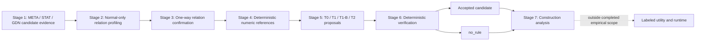

# Thesis Method Story V1

Status: `FROZEN_FOR_MASTER_DRAFT_V1`

## Method narrative

Starting from a bounded HAI P1 source-target universe, three heterogeneous
discovery methods produce candidate evidence. A common, arm-blind normal-data
protocol then profiles and independently confirms directional delayed-response
relations. Deterministic calibration materializes numeric-reference authority
for each confirmed direction. Four construction strategies populate the same
bounded proposal contract, after which an independent deterministic verifier
either admits the proposal or produces `no_rule`. The experiment compares
construction validity, stochastic robustness, and provider-call cost.
Downstream labeled utility remains outside the completed empirical scope.

The diagram is an architecture illustration, not a claim that the dashed
downstream stage was implemented or evaluated.

## Seven-stage architecture

| Stage | Purpose | Frozen input | Output | RQ/contribution | Authority boundary |
|---|---|---|---|---|---|
| 1. Candidate discovery | Expose plausible P1 source-target candidates through complementary evidence types | Frozen 144-pair P1 universe | Three top-20 lists and an unscored, provenance-preserving 47-pair union | RQ1; C1 | Candidate priority only; no causal, rule-validity, anomaly, or method-winner authority |
| 2. Normal relation profiling | Test stable continuous-step delayed-response structure on normal data | 47-pair union; normal train1/train2 | 25 fit-supported pairs and 45 supported directions | RQ1; C1/C2 | Fit support only; no causal or anomaly-performance claim |
| 3. Relation confirmation | Replay supported directions on held-apart normal calibration data without adaptation | 45 D1-supported directions; train3 | 42 confirmed directions across 23 pairs; three conflicts | RQ1; C1/C2 | No retuning, fallback, opposite-direction, or alternative-horizon search |
| 4. Deterministic numeric calibration | Bind each confirmed direction to normal-derived values and provenance | D1/D2 evidence and frozen window constants | 42 evidence records, 42 bundles, 462 bindings | RQ1/RQ3; C2 | Numeric authority is project-side; no LLM estimate becomes authoritative |
| 5. Rule construction | Compare four policies for populating one proposal contract | Same 42 relations, evidence, schema, references | T0/T1/T1-B/T2 proposals and call custody | RQ1/RQ2; C1/C4 | Proposal authority only; LLMs cannot approve outputs or invent numeric authority |
| 6. Deterministic verification | Separate generation from admission | Proposal plus frozen relation/evidence/reference contract | Accepted candidate or `no_rule` | RQ1/RQ2/RQ4; C3 | Construction validity only; `no_rule` is not provider failure, runtime abstention, or utility |
| 7. Construction analysis | Compare outcomes using correct units and denominators | Frozen outcome, call, proposal, controller, Direct-number ledgers | Validity, robustness, call efficiency, numeric error, exploratory origin summaries | RQ2/RQ3/RQ4; C4 | N=42 relations for arm comparison; no labeled utility or winner |

## Stage 1 — Candidate discovery

META, STAT, and GDN contribute different candidate-evidence types:

- **META:** official metadata, physical references, and bounded manual
  interpretation.
- **STAT:** file-local normal-data lagged change-correlation and cross-file
  directional stability.
- **GDN:** upstream-aligned learned-graph candidate evidence.

Each method supplies a top-20 list. Integration is an unscored set union with
provenance retention. Scores are not normalized or merged, and the methods are
not treated as independent scientific treatment arms. The 47-pair union is a
candidate cohort, not a result that one discovery method is superior.

## Stage 2 — Normal relation profiling

The common D1 protocol evaluates the 47 pairs without using candidate origin
as supervision. It tests both directional opportunities under the frozen
continuous-step delayed-response contract on normal train1/train2 data. The
output vocabulary is fit-supported, direction-unstable, or fit-unsupported.
These are normal-relation evidence states, not causal or anomaly states.

## Stage 3 — One-way relation confirmation

D2 evaluates only the 45 D1-supported directions on train3. Directions,
horizons, gates, and thresholds remain fixed. There is no retuning, lower-
ranked fallback, opposite-direction search, or alternative-horizon search.
"Confirmed" means one-way normal calibration confirmation.

## Stage 4 — Deterministic numeric calibration and materialization

For each of the 42 confirmed directions, E1 binds the source threshold,
stability tolerance, target scale, selected horizon, and window constants to
authoritative normal-derived references. Evidence and numeric-reference
records carry provenance and relation identity. This stage creates the
numeric authority consumed by construction; it does not construct a rule or
grant runtime authority.

## Stage 5 — Common proposal contract and construction arms

All construction arms receive the same relation evidence and reference
contract. Provider-arm initial requests hide arm identity and use the same
frozen prompt, schema, model, and sampling contract.

| Arm | Construction policy | Provider-call budget | Selection/feedback policy |
|---|---|---:|---|
| T0 | Deterministic template | 0 | One deterministic projection |
| T1 | One-shot bounded LLM | 1 per relation | Accept the single admissible proposal or terminate |
| T1-B | Independent repeated sampling | Exactly 3 per relation | No feedback; select the lowest-index admissible proposal |
| T2 | Bounded verifier-feedback construction | At most 3 per relation | Deterministic repairability classification; revise/retrieve only when eligible; otherwise `no_rule` |

The LLM proposes bounded structured fields and reference identities. It does
not supply authoritative numeric thresholds, approve its own output, access
labels, or execute at runtime.

## Stage 6 — Deterministic verification and admission

The verifier checks schema/DSL structure, relation identity, source and target,
directions, selected horizon, evidence binding, approved numeric references,
numeric origin, arbitrary literals, and unsupported variables. Admission has
two scientifically relevant terminal construction outcomes:

- **accepted rule candidate:** verifier-admissible under the frozen contract;
- **`no_rule`:** no proposal is admitted for that relation-arm cell.

Parse failure, provider failure, verifier rejection, `no_op`, and runtime
abstention remain distinct states. An accepted candidate is not thereby useful
or runtime-authorized.

## Stage 7 — Construction analysis

The relation is the primary scientific unit, N=42. Provider calls and proposals
are cost/robustness observations and do not become independent relation
samples. Analysis includes:

- relation-level acceptance, `no_rule`, concordance, and paired discordance;
- T1-B cumulative yield, selected calls, rejection and parse accounting;
- T2 feedback eligibility and controller-action counts;
- calls per accepted relation and accepted relations per call;
- Direct-number normalized errors against deterministic references; and
- exploratory, overlapping candidate-origin summaries.

Validity and call cost are not collapsed into a utility or winner score.

## Terminology ladder

1. **Candidate pair:** Stage 1 plausibility evidence.
2. **Fit-supported normal delayed-response direction:** Stage 2 evidence.
3. **Calibration-confirmed normal delayed-response relation direction:**
   Stage 3 evidence.
4. **Construction-evidence record / approved numeric-reference bundle:**
   Stage 4 authority.
5. **Rule-construction proposal:** unverified Stage 5 output.
6. **Verifier-admissible rule candidate / accepted construction outcome:**
   Stage 6 output.
7. **`no_rule`:** no proposal admitted for the relation-arm cell.
8. **Runtime rule:** not produced or validated by the completed study.

## Downstream boundary

Labeled utility, detector integration, Rule v2, runtime, deployment, and
winner selection are outside the completed empirical scope. A post-result,
pre-label utility protocol was developed, but its focused re-audit left two
authority/validation issues open. Real labels, real test features, and real
utility values were never accessed or computed. The correct statement is:

> Utility was not evaluated.
