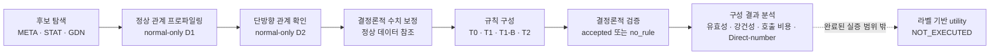

# 기술 부록 — 연구 구조, 연구질문, 결과 및 주장 경계

이 부록은 지도교수 검토에 필요한 과학적 내용만 요약합니다. 긴 감사
해시, transport 기록 및 custody 구현 세부사항은 제외했습니다.

## 1. 연구 구조

본 연구의 완료된 실증 범위는 후보 관계 탐색에서 검증기 적격 규칙
후보의 구성과 입장 결정까지입니다. 라벨 기반 이상탐지 utility, detector
결합, Rule v2 및 운영 runtime은 포함되지 않습니다.

## 2. 연구질문

### Primary RQ1 — Evidence-bound construction feasibility

**English frozen RQ**

> Within the frozen HAI P1 cohort, can confirmed multivariate CPS relation
> directions and deterministic normal-data parameter references be transformed
> into verifier-admissible rule candidates under a bounded construction
> protocol?

**한국어**

> 동결된 HAI P1 코호트에서 확인된 다변량 CPS 방향 관계와 정상 데이터
> 기반 결정론적 매개변수 참조를 경계가 명시된 구성 프로토콜 아래
> 검증기 적격 규칙 후보로 변환할 수 있는가?

### Primary RQ2 — Construction-strategy comparison

**English frozen RQ**

> How do deterministic template construction, one-shot bounded LLM
> construction, independent repeated LLM sampling, and bounded verifier-
> feedback construction differ in relation-level validity yield, stochastic
> robustness, and provider-call cost?

**한국어**

> 결정론적 템플릿 구성, 단일 호출 bounded LLM 구성, 독립 반복 LLM
> sampling 및 bounded verifier-feedback 구성은 관계 수준 유효성 산출률,
> 확률적 강건성 및 provider-call 비용에서 어떻게 다른가?

### Primary RQ3 — Direct numeric estimation accuracy

**English frozen RQ**

> How accurately does direct LLM estimation reproduce the deterministic
> normal-derived numeric references required by the frozen rule contract?

**한국어**

> 직접 LLM 수치 추정은 동결된 규칙 계약이 요구하는 정상 데이터 기반
> 결정론적 수치 참조를 얼마나 정확하게 재현하는가?

`sufficiently accurate`가 아니라 `how accurately`로 질문합니다. 독립적인
보편적 충분성 threshold가 동결되지 않았기 때문입니다.

### Secondary RQ4 — Fail-closed construction admission

**English frozen RQ**

> When a construction proposal violates the frozen contract, can
> deterministic verification and explicit `no_rule` admission prevent it from
> entering the accepted rule set?

**한국어**

> 구성 제안이 동결된 계약을 위반할 때, 결정론적 검증과 명시적
> `no_rule` 입장 정책은 해당 제안이 승인 집합에 포함되는 것을 방지할
> 수 있는가?

RQ4는 세 건의 실제 invalid proposal에 근거한 보조 governance 질문이며,
광범위한 runtime 안전성 질문이 아닙니다.

## 3. Contribution 구조

| ID | Contribution | 범위 |
|---|---|---|
| C1 | Evidence-bound candidate-to-rule construction pipeline | 후보 탐색, 정상 관계 적합·확인, 수치 참조, 제안 및 검증을 연결 |
| C2 | Deterministic normal-data numeric authority | 정상 데이터 보정과 reference binding을 권위 있는 수치 원천으로 사용 |
| C3 | Deterministic verification and fail-closed `no_rule` admission | verifier-invalid proposal의 승인 집합 진입을 차단 |
| C4 | Controlled T0/T1/T1-B/T2 comparison | 구성 유효성, 확률적 강건성, provider-call 비용 및 부정적 결과를 함께 보고 |

C1–C4는 구성, 수치 권한, 검증 및 governance에 관한 기여입니다. 이상탐지
성능 향상, T2 우월성, feedback recovery 효과 또는 운영 배포 검증을
기여로 주장하지 않습니다.

## 4. 후보에서 확인된 관계까지

| 단계 | 입력 | 결과 | 해석 경계 |
|---|---:|---:|---|
| Candidate discovery | P1 144-pair universe; META/STAT/GDN 각 top-20 | 47 unique pairs | 무점수 합집합; 방법별 승자 없음 |
| D1 normal relation fit | 47 pairs / 94 direction opportunities | 25 supported pairs / 45 supported directions | 정상 관계 적합 근거 |
| D2 one-way confirmation | 45 supported directions | 42 confirmed / 3 conflicts; 23 pairs retained | 인과 또는 anomaly 성능 확인이 아님 |
| E1 materialization | 42 confirmed directions | 42 evidence records / 462 numeric bindings | 구성 입력과 정상 데이터 수치 권한 |

META/STAT/GDN 멤버십은 중첩됩니다. 최종 관계 중 GDN 멤버십은 5개로
작기 때문에 후보 출처 효과는 `INCONCLUSIVE`입니다.

## 5. 네 구성 전략의 핵심 결과

| Arm | Provider calls | Materialized | Admissible | Rejected | Parse failure | Accepted | `no_rule` |
|---|---:|---:|---:|---:|---:|---:|---:|
| T0 | 0 | 42 | 42 | 0 | 0 | 42/42 | 0 |
| T1 | 42 | 42 | 42 | 0 | 0 | 42/42 | 0 |
| T1-B | 126 | 125 | 122 | 3 | 1 | 42/42 | 0 |
| T2 | 42 | 42 | 39 | 3 | 0 | 39/42 | 3 |

### Validity ceiling

T0, T1, T1-B가 모두 42/42에 도달했습니다. 따라서 현재 construction
validity endpoint는 세 arm의 downstream 차이를 구별하지 못합니다. T0가
provider call 없이 ceiling에 도달했다는 사실은 endpoint의 discrimination
한계를 뜻하며, T0가 useful-rule winner라는 뜻은 아닙니다.

### T1

T1은 본 42-relation 코호트와 한 번의 동결된 실행에서 관계당 한 번의
호출로 42/42를 얻었습니다. 이는 본 조건에서의 one-shot feasibility이며,
일반적인 LLM 신뢰성 주장이 아닙니다.

### T1-B

| 항목 | 결과 |
|---|---:|
| Total calls | 126 |
| Materialized proposals | 125 |
| Admissible proposals | 122 |
| Verifier rejections | 3 |
| Schema parse failures | 1 |
| Cumulative yield after call 1/2/3 | 41 / 41 / 42 |
| Selected call 1/2/3 | 41 / 0 / 1 |
| Additional calls beyond first-draw budget | 84 |
| Relations recovered after first draw | 1 |

T1-B는 첫 draw 실패 한 건을 call 3에서 복구했고, 선택되지 않은 call 2의
parse failure가 관계 수준 최종 승인을 훼손하지 않았습니다. 그러나 T1
대비 3배 호출을 사용했으므로 결과는 `PARTIALLY_SUPPORTED`인 제한적
확률 강건성으로 해석합니다.

### T2

T2는 bounded verifier-feedback construction으로 설계되었습니다.

- Accepted: 39/42
- `no_rule`: 3
- Feedback eligible: 0
- Revise: 0
- Retrieve: 0
- Follow-up generation: 0
- Successful recovery: 0
- Rejected-case classification: 세 건 모두 unsupported variable을 포함한
  non-repairable issue

따라서 **T2의 증분 유효성 이득은 관찰되지 않았습니다.** Feedback recovery
경로는 이 실행에서 실증적으로 작동하지 않았습니다. 세 `no_rule`은
invalid proposal이 승인 집합에 들어가지 않은 구성 admission 근거이지만,
anomaly utility 또는 deployment safety의 근거는 아닙니다.

## 6. Direct-number 결과

42개 응답 모두 구조적으로 완전했고 missing, nonfinite/parse 및 sign-domain
violation은 각각 0이었습니다. 그러나 수치 오차는 컸습니다.

| Numeric role | N | Mean normalized error | Median | P90 | Error >0.25 |
|---|---:|---:|---:|---:|---:|
| Source step threshold | 42 | 0.6621 | 0.5984 | 0.9938 | 42/42 |
| Source stability tolerance | 42 | 1.1381 | 0.4904 | 5.3937 | 24/42 |
| Target noise scale | 42 | 39.6043 | 0.9839 | 86.5962 | 42/42 |

정확한 해석은 **schema validity does not imply numerical accuracy**입니다.
이 결과는 본 동결 계약에서 정상 데이터 기반 deterministic calibration을
지지합니다. 모든 상황에서 LLM이 수치를 추정할 수 없다는 일반 명제나,
Direct-number 오차가 anomaly 성능 저하를 증명한다는 주장은 하지 않습니다.

## 7. Claim status

| Claim | Result | 지도교수용 논문 해석 |
|---|---|---|
| A Pipeline feasibility | `SUPPORTED` | 42개 확인 방향을 대상으로 근거 결속형 구성 파이프라인의 실행 가능성을 확인 |
| B T1 one-call feasibility | `SUPPORTED` | 본 코호트·단일 실행에서 관계당 1회 호출로 42/42 |
| C Repeated-sampling robustness | `PARTIALLY_SUPPORTED` | 84회 추가 호출로 첫 draw 실패 1건 복구 |
| D T2 validity improvement | `NOT_SUPPORTED` | 추가 유효성 이득 미관찰; feedback recovery 미실행 |
| E T2 efficiency advantage | `NOT_SUPPORTED` | T1과 같은 42 calls에서 3개 적은 승인 |
| F Deterministic calibration rationale | `SUPPORTED` | 구조 적합이 수치 정확성을 보장하지 않음 |
| G `no_rule` admission safety | `SUPPORTED` | invalid proposal 3건을 구성 승인 집합에서 제외 |
| H Candidate-origin effect | `INCONCLUSIVE` | 중첩 subgroup과 GDN N=5로 결론 불가 |
| Labeled utility | `NOT_EXECUTED` | Utility는 평가되지 않음 |

어느 arm도 downstream winner로 분류하지 않습니다.

## 8. Utility 중단 경위

1. T0/T1/T1-B의 construction-validity ceiling이 관찰되었습니다.
2. 실제 유용성 구별을 위해 라벨 기반 utility가 과학적으로 중요해졌습니다.
3. 구성 결과 관찰 후, 실제 라벨 접근 전 utility protocol을 별도로
   동결했습니다.
4. Independent audit에서 evaluator-authority ambiguity를 확인했습니다.
5. Bounded remediation으로 대부분을 닫았지만 focused re-audit에서 두
   문제가 남았습니다: opportunity/abstention denominator binding과
   malformed input/state의 fail-closed validation입니다.
6. Protocol audited, evaluator implementation ready 및 execution authorization
   상태를 모두 false로 유지했습니다.
7. 실제 라벨 값, 실제 테스트 특징값 및 실제 utility 값에 접근하거나
   계산하지 않았습니다.

| 항목 | 최종 상태 |
|---|---|
| Real label values accessed | 0 |
| Real test-feature values accessed | 0 |
| Real utility values computed | 0 |
| Utility protocol audited | false |
| Utility evaluator implementation ready | false |
| Utility execution authorized | false |

정확한 결론은 다음과 같습니다.

> **Utility는 평가되지 않았습니다.**

이는 empirical utility outcome이 아니라 과학적·권한적 stopping boundary입니다.

## 9. 핵심 limitations

- HAI 23.05의 단일 P1 process scope
- 23개 pair에서 확인된 42개 direction
- 단일 provider/model snapshot과 한 번의 실현된 확률 실행
- T0/T1/T1-B의 construction-validity ceiling
- T2 feedback path 미실행
- META/STAT/GDN 멤버십 중첩 및 GDN N=5
- 라벨 기반 anomaly utility 미평가
- Detector integration 및 false-negative recovery 미평가
- Production Rule v2/runtime 미검증
- Post-result utility protocol 설계
- 평가 권한이 완결되지 않아 label access 전 utility path 중단

이 한계들은 구성·calibration·verification·governance 결과를 무효화하지
않지만 anomaly-performance 주장을 제한합니다.

## 10. 지도교수 선택을 위한 두 scope

### PATH A — NARROWED CONSTRUCTION-GOVERNANCE THESIS (권장)

새 실험 없이 writing으로 진행합니다. 주장은 construction validity,
deterministic calibration, verification, fail-closed admission 및 call-cost
comparison에 한정합니다.

### PATH B — ANOMALY-EFFECTIVENESS THESIS (명시적 요구가 있을 때만)

학위 요건상 anomaly-effectiveness evidence가 반드시 필요하다는 구체적
피드백이 있을 경우에만 label-aware utility evidence를 새로운 과학 작업으로
설계합니다. 기존 중단 경로를 자동 재개하지 않습니다.

T2를 긍정적으로 보이게 하기 위한 provider rerun, cohort/threshold/metric의
사후 변경, repairable 사례 선별 또는 rescue experiment는 선택지에 포함하지
않습니다.
