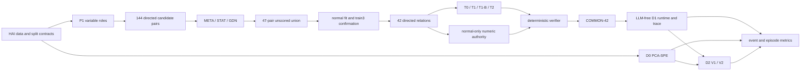

# 4. 제안 방법

## 4.1 전체 아키텍처

제안 방법은 데이터 준비, 후보 발견, 정상 관계 프로파일링, 제한된 규칙
구성, 수치 권한, 결정론적 검증, LLM-free runtime, utility 분석의 여덟
단계로 구성된다.

각 단계는 이전 단계의 artifact identity와 허용된 split role을 검사한다.
graph score, LLM proposal, numeric calibration, verifier acceptance, runtime
authority, utility result는 서로 다른 권한이다.

## 4.2 데이터와 leakage-safe 역할 분리

원시 timeline은 windowing 전에 역할별 split으로 분리된다. HAI 정상
train1/2는 후보와 관계 fit, train3는 일방향 relation confirmation과 D0
threshold calibration, train4는 normal guard/sanity에 사용된다. test1은
label-aware INNER utility에만 사용되며 selection과 parameter tuning에
사용하지 않는다. test2는 held-out OUTER로 분리됐다.

relation evidence와 numeric authority는 정상 데이터에서만 만들어진다.
test1 label은 label-blind prediction이 지속적으로 고정된 뒤 metric 계산에
한 번 사용된다. 이 순서는 validity와 utility를 분리하고 결과 기반 규칙
변경을 막는다.

## 4.3 Process와 변수 역할 범위

연구 대상은 HAI 23.05의 P1 Boiler다. continuous-step feasibility protocol
아래에서 P1만 source–target delayed-response 규칙을 구성할 수 있는 범위를
충족했다. source는 검토된 control command 또는 actuator feedback이고,
target은 continuous process sensor다. 12개 source와 12개 target의 Cartesian
product에서 self/role-incompatible 항목을 제외한 144개 방향 후보 universe를
고정했다.

변수 역할 metadata는 탐색 공간을 줄이는 도메인 지식이다. 이는 관계가
인과적임을 보장하지 않고, 다른 공정에 자동 이전되지 않는다.

## 4.4 후보 관계 발견

### 4.4.1 META

META arm은 feature value를 읽지 않고 공식 metadata의 변수 역할, graph
adjacency, subsystem support를 사용한다. 명시적 또는 구조적으로 지원된
pair를 순위화하되 부족한 결과를 임의 pair로 채우지 않는다.

### 4.4.2 STAT

STAT arm은 normal train1/2에서 file-local source difference와 future target
difference 간 lagged correlation을 1/5/10/30/60초에 계산한다. 파일 경계를
넘어 difference나 lag를 만들지 않는다. 이 score는 statistical candidate
evidence이며 delayed response의 확정이나 causality가 아니다.

### 4.4.3 GDN

GDN arm은 candidate mask 안의 learned graph ranking을 사용한다. self-loop와
candidate edge를 구분하고, export된 모든 edge가 144-pair universe에 속함을
검사한다. 사용된 GDN 경로는 pinned upstream과 compatibility/fidelity 검증에
결합되지만, graph edge는 원인 또는 root cause로 해석하지 않는다.

### 4.4.4 Unscored union

세 arm의 primary top-20을 source–target identity로 de-duplicate하고 arm
provenance를 보존한 set union을 만든다. 서로 다른 score scale을 합치거나
재순위화하지 않는다. 결과는 47개 고유 pair다. 이 단계의 목적은 하나의
ranking winner를 선택하는 것이 아니라 서로 다른 발견 경로가 제공하는
후보 범위를 relation profiling에 전달하는 것이다.

## 4.5 정상 시간 관계 프로파일링

각 후보 pair에서 source의 안정된 step-up/down event를 찾는다. 같은 source의
인접 사건은 10초 refractory로 묶고, 다른 source의 전이가 ±2초 inclusive
범위에 있으면 isolation 조건에 따라 제외한다. 각 사건에서 1, 5, 10, 30,
60초 horizon의 target response를 측정한다.

train1/2 fit gate는 pooled support 20 이상, 각 train support 5 이상,
pooled consistency 0.70 이상, file consistency 0.60 이상, robust effect ratio
2.0 이상을 요구한다. 이 조건은 값의 최적성을 의미하지 않고, 반복 관측과
방향 안정성을 위한 frozen gate다. 선택 horizon은 fit evidence에서
결정되며 결과 label과 독립적이다.

## 4.6 일방향 confirmation과 확정 관계

fit을 통과한 관계는 train3에서 한 번만 confirmation한다. support 5 이상,
direction consistency 0.60 이상, effect ratio 1.0 이상을 요구하며 대체
horizon search는 하지 않는다. 이 결과 47개 pair 중 23개 pair에서
42개 directed temporal relation이 확인됐다. increase/decrease direction은
서로 다른 relation identity다.

확정 관계는 정상 데이터에서 관찰된 규칙 구성 근거다. 공격을 탐지한다는
보장, 물리 법칙, causal mechanism을 뜻하지 않는다.

## 4.7 규칙 구성 arm

- **T0:** deterministic template baseline. 관계 descriptor를 고정 schema로
  변환한다.
- **T1:** 한 번의 constrained LLM construction. 허용 candidate, schema,
  evidence reference 밖의 출력을 거부한다.
- **T1-B:** T2와 같은 총 provider-call budget 아래 독립 생성만 반복해
  verifier feedback의 효과와 단순 재표본화를 구분한다.
- **T2:** verifier 결과에 따라 revise/retrieve/no_rule 중 제한된 action을
  선택하는 bounded feedback construction.

모든 arm은 같은 relation, evidence, parameter strategy, DSL, verifier,
provider/model policy와 총 call budget을 공유한다. provider failure, invalid
JSON, verifier rejection, budget exhaustion은 no_rule로 숨기지 않는다.
동결 결과에서 T0/T1/T1-B는 COMMON 42/42와 동등한 실행 규칙을 만들었고,
T2는 39/42 accepted와 3 no_rule이었다. feedback action은 0이므로 agentic
repair가 성능을 향상했다는 결론은 내리지 않는다.

## 4.8 결정론적 수치 권한

LLM output에는 자유 수치 파라미터를 허용하지 않는다. trigger stability,
lag/window, target response tolerance와 같은 실행 수치는 normal evidence와
calibration parameter artifact를 reference한다. 공개 규칙은 parameter
identity를 포함하지만 민감한 수치 payload를 노출하지 않는다.

이 설계는 LLM이 보기 좋은 숫자를 발명하거나 utility 결과에 맞춰
threshold를 수정하는 경로를 차단한다. 숫자가 정상 데이터에서 왔다는
사실은 최적성을 증명하지 않으므로 hyperparameter sensitivity 한계는
별도로 보고한다.

## 4.9 결정론적 verifier

verifier는 최소 다음 범주를 검사한다.

1. schema와 구조적 완전성;
2. source/target 변수 역할과 candidate membership;
3. graph edge와 normal evidence binding;
4. parameter provenance와 단위·시간 일관성;
5. split compliance와 test boundary;
6. 복잡도, abstention, output semantics;
7. duplicate/conflict와 runtime operational contract;
8. causality·root-cause 등 금지 claim boundary.

verifier acceptance는 runtime authorization과도 분리된다. LLM은 자신의
규칙을 승인할 수 없고, attack label utility는 deterministic validity를
결정하지 않는다.

## 4.10 실행 규칙 runtime과 설명 trace

runtime은 accepted rule과 명시적 authority, 정렬된 input window, parameter
reference를 받아 결정론적으로 실행된다. dynamic Python execution이나 LLM
call은 없다. source trigger, pre-trigger stability, lag/window coverage,
expected target direction, tolerance, persistence, abstention을 순서대로
평가한다.

trace는 source variable, target variable, trigger, horizon, expected direction,
각 operator의 pass/fail/abstain, 최종 outcome을 묶는다. 이를 본 논문에서는
**time-variable-relation localization**이라 부른다. 이는 어느 관계와 시간
창이 위반됐는지 보여주지만, ARTIST식 segment selection이나 causal root
cause 분석과 동일하지 않다.

## 4.11 Utility 평가와 fusion

### D1 rule-only

COMMON-42의 모든 적용 가능한 기회를 자동 census하고 LLM-free rule engine을
실행한다. rule violation을 point alarm으로 만들고 event/episode metric을
계산한다.

### D0 PCA-SPE

37개 P1 feature를 normal-only standardization한 후 PCA의 residual subspace
SPE를 anomaly score로 사용한다. cumulative explained variance 0.95를 넘는
최소 k를 선택하고 normal train3의 0.999 quantile을 threshold로 사용한다.
`score > threshold`만 alarm이다.

### D2 V1

D0 alarm을 모두 보존하면서, 같은 physical second에 서로 다른 source의
D1 alarm이 두 개 이상 있을 때만 rule recovery를 추가한다. 같은 source의
중복 규칙은 한 번만 센다.

### D2 V2

각 D1 evidence token을 그 규칙의 frozen native horizon까지 causal/inclusive
하게 유지한다. 시점 t에서 active token의 distinct source가 두 개 이상이면
rule recovery를 추가한다. global window나 single-source fallback은 없다.

두 fusion 모두 D0 score, label, rule numeric reevaluation을 사용하지 않고
combined prediction을 label 전에 고정한다.
